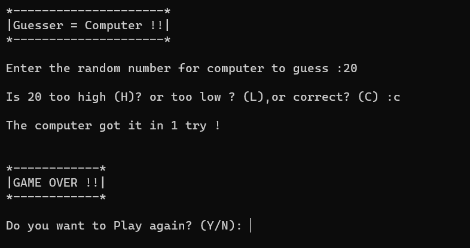

->This is a simple random numbers guessing game made using python.

->To run this program you need python or python3 in your computer

->Fist copy or clone this program . cd to your directory and run the program using this command in cmd 'python random_num_guess.py'

->There are 2 modes

->mode 1:

->you give the number and computer guesses it .

->mode 2:

->computer generates a random number using random.randint() function and the value is stored in com_num

->you have to guess the number and you have 10 tries .

->Enjoy playing the game :) .
